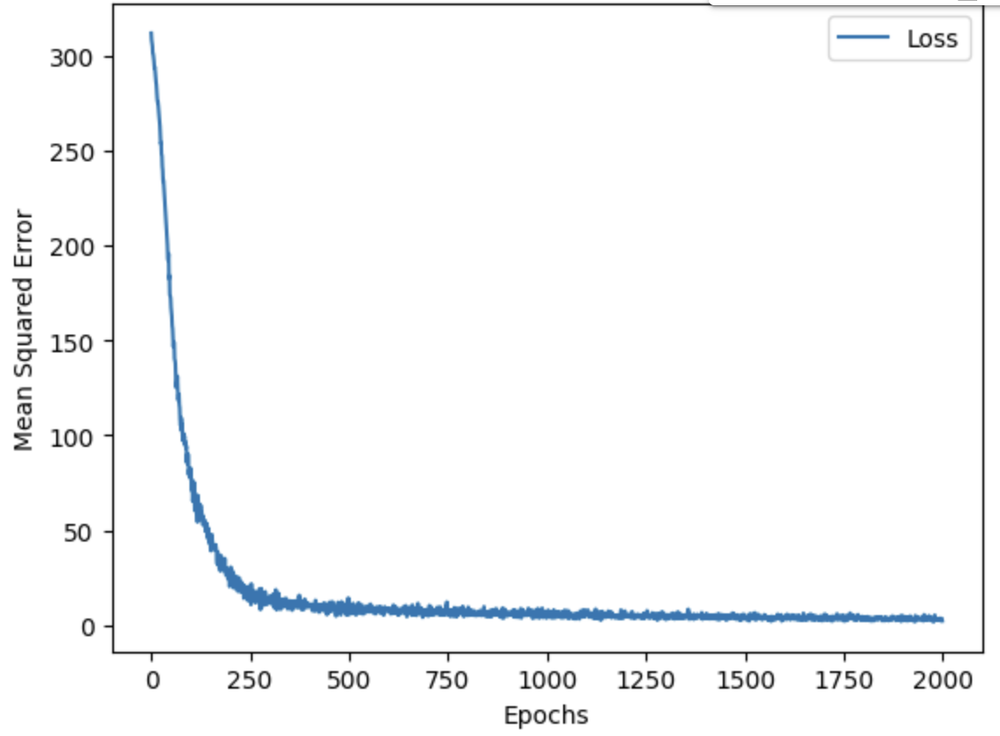

# Byzantine Reing Prediction

This is a model which predicts how long Byzantine emperors will reign trained courtesy of the Byzantine Emperors (330-1453) dataset on Kaggle.

## Results of the model

Above is the loss function through the traininig. The loss significantly dropped until the 250th epoch. After 250 epochs the loss steadily dropped to between 2 to 3 at the end.

| Emperor Name| Predicted Reign Length | Original Reign Length |
| --------------- | --------------- | --------------- |
| Manuel II    | 35 years | 34 years    |
| Basil II    | 49 years   | 50 years   |
| Constantine I    | 17 years   | 31 years   |
| John VII    | 3 years   | 3 years   |
| Leo VI    | 24 years   | 26 years  |
| Constantine VII    | 44 years   | 46 years   |

The table above shows some prediction made on the test data. Altough later emperors were easier to predict the model struggled with early emperors such as Constantine I due to the empire not beign quite in a stable state. Altough after the first hundred years of the establishement of the Byzantine Empire the model was generally quite accurate in it's predictions generally having an offset of three years at maximum. The struggle in the first 100-150 years likely happened because of the barbarian raids on the Eastern and Western Roman Empire.
